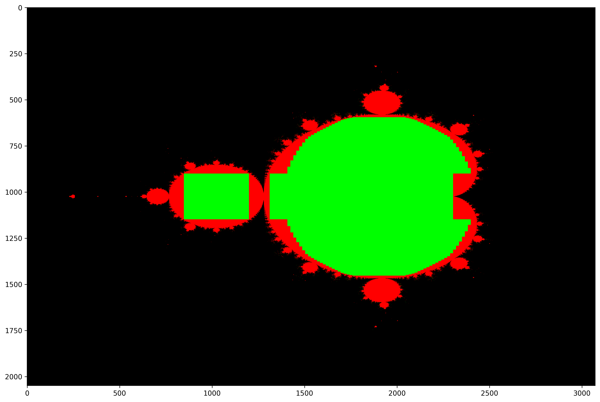

# Elipse Optimization
The following plots show, which area (green) does not have to be computed from the converging points of the Mandelbrot set (red).

### Matrix size 3072x2048
74.78 % converging values can be skipped:

### Matrix size 6144x4096
75.10 % converging values can be skipped:

### Matrix size 12288x8192
75.11 % converging values can be skipped:

