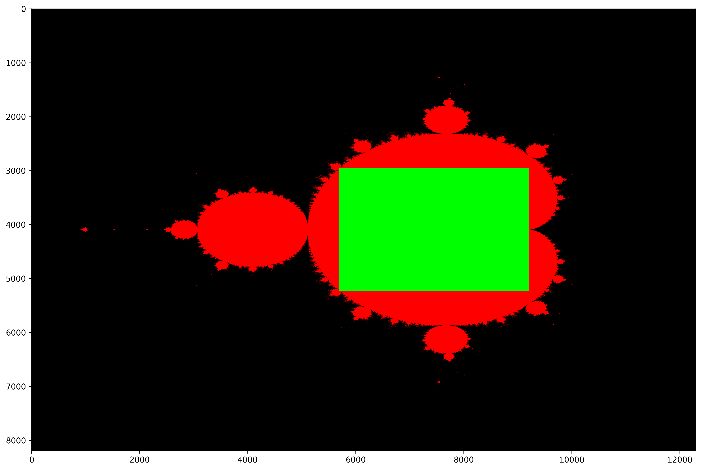

# Rectangle Optimization
The following plots show, which area (green) does not have to be computed from the converging points of the Mandelbrot set (red).

### Matrix size 3072x2048
46.27 % converging values can be skipped:

### Matrix size 6144x4096
46.26 % converging values can be skipped:

### Matrix size 12288x8192
64.48 % converging values can be skipped:

